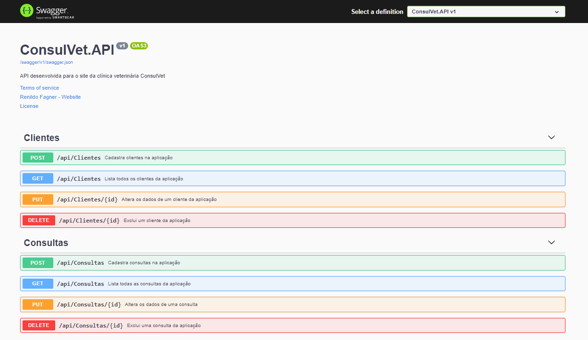

# <p align="center">ConsulVet.API</p>
<h3 align="center">API desenvolvida para o site da clínica veterinária ConsulVet</h3>

<p align="center">
    
</p> <br><br>


[](https://github.com/rfagner/ConsulVet.API/blob/main/LICENSE) <br><br>


<br><br>


# Sobre o projeto
REST API em ASP.NET Core com: ADO.NET, Repository Pattern e Singleton e tem como principal objetivo gerenciar uma clínica veterinária e facilitar o acesso aos dados através do ADO.NET.<br><br>
A aplicação consiste em:<br><br>
- Cadastrar um usuário no sistema<br><br>
- Marcar consultas com veterinário<br><br>
- Gerar o resultado da consulta com um diagnóstico prévio<br><br>

# Tecnologias usadas
- C#<br><br>
- .NET 5<br><br>
- ASP.NET<br><br>
- ADO.NET<br><br>
- Repository Pattern<br><br>
- Singleton<br><br>
- Postman<br><br>
- SQL Server<br><br>
- Swagger<br><br>


# Como executar o projeto

Pré-requisitos: .NET 5

```bash
# clonar repositório
git clone https://github.com/rfagner/ConsulVet.API

# entrar na pasta do projeto DesafioBRQ
cd ConsulVet.API

# executar o projeto
dotnet run

``` 
<br><br>
# Autor

Renildo Fagner dos Santos de Assis

https://www.linkedin.com/in/rfagner/
